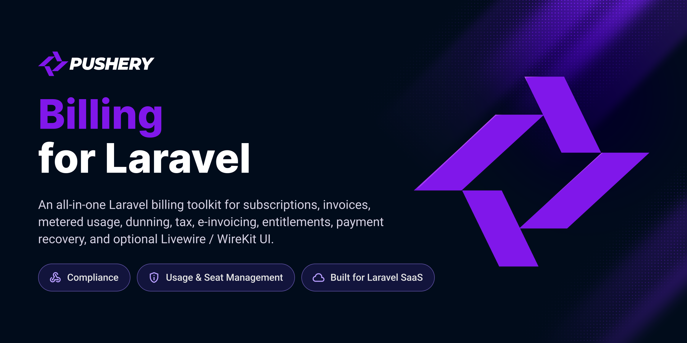

<p align="center">
  <a href="https://github.com/pushery/billing-for-laravel">
    
  </a>
</p>

# Billing for Laravel

[](https://packagist.org/packages/pushery/billing-for-laravel)
[](https://packagist.org/packages/pushery/billing-for-laravel)
[](https://packagist.org/packages/pushery/billing-for-laravel)
[](https://phpstan.org)
[](https://laravel.com/docs/pint)
[](LICENSE)

Provider-neutral billing for Laravel: subscriptions, invoices, metered usage, dunning, tax and e-invoicing. Stripe-first, on provider-neutral contracts.

Everything crosses a small set of contracts, so your app talks to _billing_ — not to Stripe. The Stripe driver ships today. The contracts are the seam a second provider slots into.

## Highlights

- **Two-layer, provider-neutral core** — `PaymentRails` (moves money, stores mandates) and `BillingEngine` (the recurring cycle). Money crosses the boundary as a `Money` value object, never a raw provider response.
- **Subscriptions** — in-app upgrade/downgrade **swap** with a proration **preview**, cancel-into-grace, resume, and immediate cancel — the client submits a tier _key_, never a price (anti-price-injection).
- **Account hub** — a publishable Livewire hub (overview, subscription, change-plan, payment methods, invoices, usage, payment recovery, danger zone) with config-driven routes and a self-contained Blade view set. Drop a `<x-billing::banner />` into your layout to surface a failed payment, a lapsing grace period or a trial about to end.
- **Webhooks** — an idempotent, signature-verified backbone with effects out of the box (plan-sync, add-on credit, dunning notice, invoice persistence) and a fail-loud webhook-secret guard.
- **Usage-based billing** — charge a base fee _plus_ what a customer actually used, with a retry that cannot double-bill, an outage that cannot silently lose revenue, oversell-safe reserve/work/settle metering, quota policies, and prepaid units that never expire.
- **Entitlements & seats** — a separate `License` gate for what a tier _unlocks_ (feature grants + numeric limits), independent of what it costs, plus team seats and a User-XOR-Team owner model.
- **Dunning, suspension & tax** — a config-driven multi-level dunning ladder, a per-surface `423 Locked` suspension gate driven by a stored delinquency clock (outage-safe), and provider tax (Stripe Tax) on the invoice with a pluggable `TaxCalculator` seam for a local computation path.
- **E-invoicing** — dependency-free **EN 16931** writers in both syntaxes (**XRechnung** UBL and **ZUGFeRD / Factur-X** CII), an optional hybrid **PDF/A-3** embed, and a **DATEV** (EXTF Buchungsstapel) export.
- **Security-first** — a `billing.enabled` master switch that makes the whole surface disappear, a scoped Content-Security-Policy for the hub, a fail-closed money-eligibility gate, and card capture that happens on the provider's own hosted page, so no card data ever touches your app (PCI SAQ-A).

## Requirements

- PHP 8.4+
- Laravel 13+

Tested against SQLite, PostgreSQL and MySQL 8.4, so it runs on Laravel Cloud (serverless Postgres and MySQL 8.4 LTS) out of the box.

## Installation

```bash
composer require pushery/billing-for-laravel
php artisan billing:install
php artisan migrate
```

The service provider is registered through package discovery. The Stripe driver builds on [Cashier](https://laravel.com/docs/billing), so set your Stripe keys (`STRIPE_KEY`, `STRIPE_SECRET`, `STRIPE_WEBHOOK_SECRET`) as usual.

> **Billable model isn't `App\Models\User`?** Set `BILLING_CUSTOMER_MODEL` **before** you run `billing:install`, or it adds the billing columns to `users`. See the [installation guide](https://github.com/pushery/billing-for-laravel/blob/main/docs/single-seller/installation.md) for the full detail.

## Documentation

The full documentation lives in **[`docs/`](https://github.com/pushery/billing-for-laravel/blob/main/docs/README.md)** — start there. (It ships in the repository, not in the Composer dist, so these links point at the repository.)

- **New here?** [Choosing your setup](https://github.com/pushery/billing-for-laravel/blob/main/docs/choosing-your-setup.md), then the [guide](https://github.com/pushery/billing-for-laravel/blob/main/docs/README.md#the-guide) (installation → configuration → subscriptions → usage → invoicing → …).
- **Reference:** [configuration](https://github.com/pushery/billing-for-laravel/blob/main/docs/reference/configuration.md) · [commands](https://github.com/pushery/billing-for-laravel/blob/main/docs/reference/commands.md) · [events](https://github.com/pushery/billing-for-laravel/blob/main/docs/reference/events.md) · [contracts](https://github.com/pushery/billing-for-laravel/blob/main/docs/reference/contracts.md) · [database](https://github.com/pushery/billing-for-laravel/blob/main/docs/reference/database.md)
- **Guides:** [migrating from Cashier](https://github.com/pushery/billing-for-laravel/blob/main/docs/guides/migrating-from-cashier.md) · [migrating from your own billing code](https://github.com/pushery/billing-for-laravel/blob/main/docs/guides/migrating-from-custom-billing.md) · [testing](https://github.com/pushery/billing-for-laravel/blob/main/docs/guides/testing.md) · [upgrading](https://github.com/pushery/billing-for-laravel/blob/main/docs/guides/upgrading.md) · [troubleshooting](https://github.com/pushery/billing-for-laravel/blob/main/docs/guides/troubleshooting.md)
- **Compliance:** [invariants](https://github.com/pushery/billing-for-laravel/blob/main/docs/compliance/invariants.md) · [retention & erasure](https://github.com/pushery/billing-for-laravel/blob/main/docs/compliance/retention-and-erasure.md) · [security](https://github.com/pushery/billing-for-laravel/blob/main/docs/compliance/security.md)

## Security

The card is captured on the provider's own hosted page, so no card data ever touches your app (PCI SAQ-A), and the webhook backbone refuses to boot in production without a signing secret. Please review the [security policy](SECURITY.md) and report vulnerabilities privately rather than opening a public issue.

## Built by Pushery

This package is built and maintained by [Pushery](https://www.pushery.com) — a Berlin-based studio building Laravel applications, SaaS products, and open-source tools.

Building a Laravel UI? [WireKit](https://wirekit.app), Pushery's open-source Livewire component kit, gives you a themeable component library out of the box. Browse the rest of our work at [pushery.com](https://www.pushery.com).

## License

The MIT License (MIT). See [LICENSE](LICENSE) for details.
